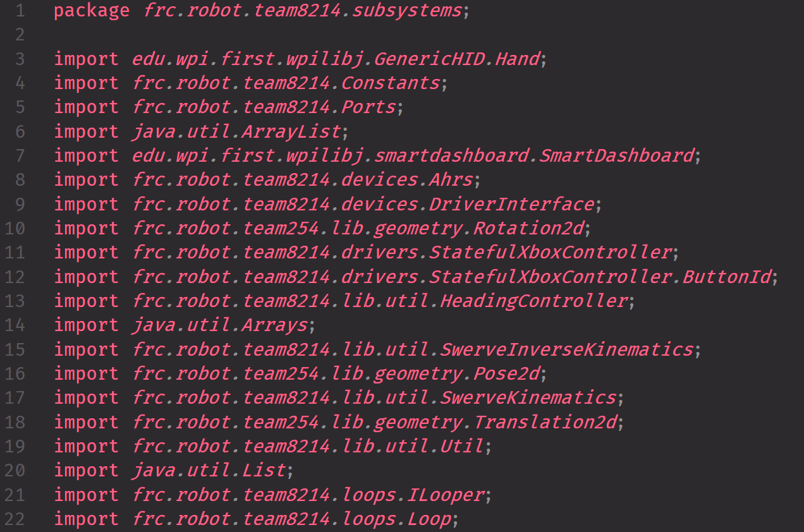
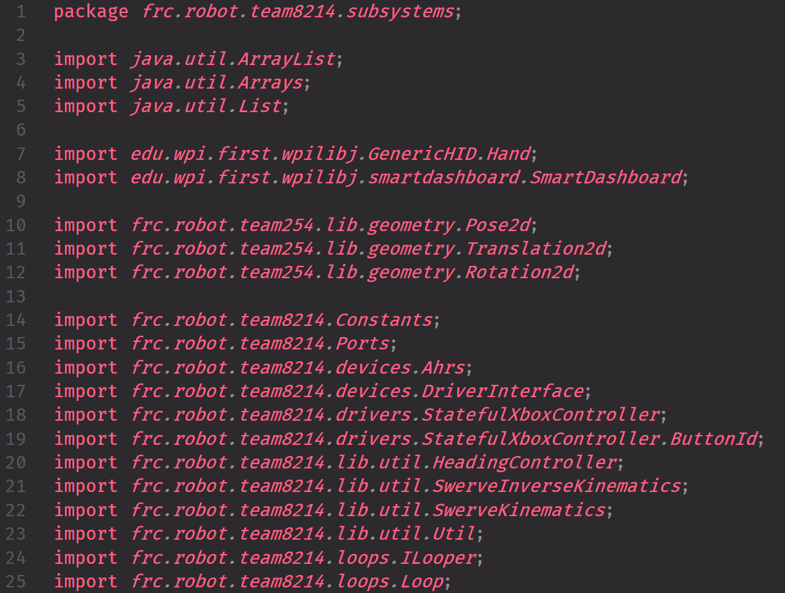
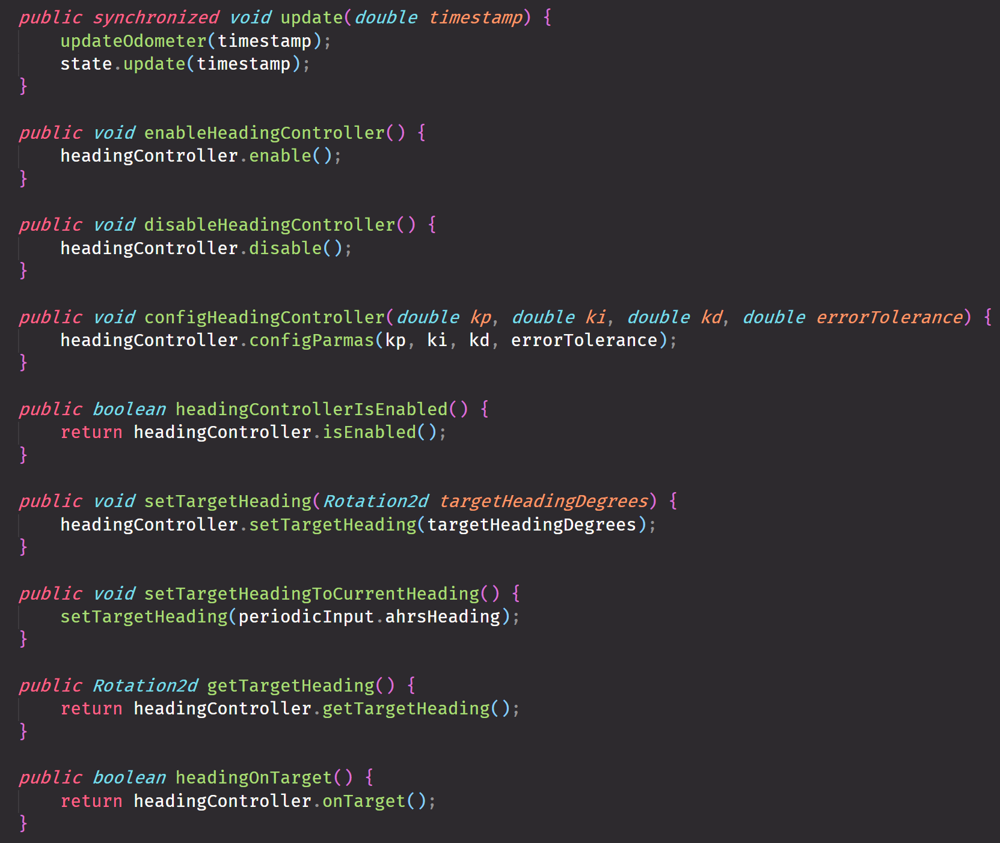
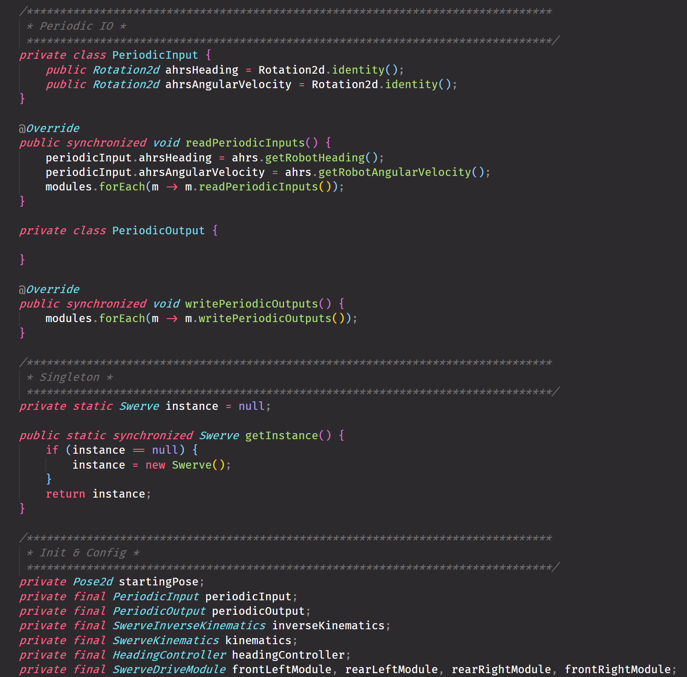
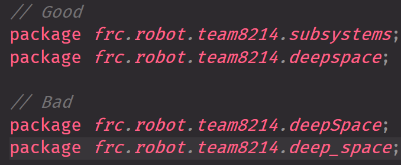
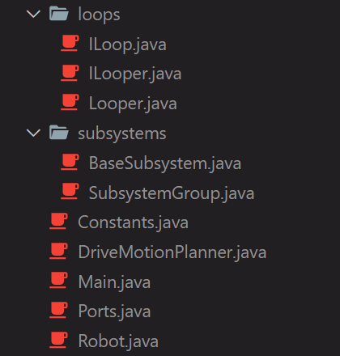
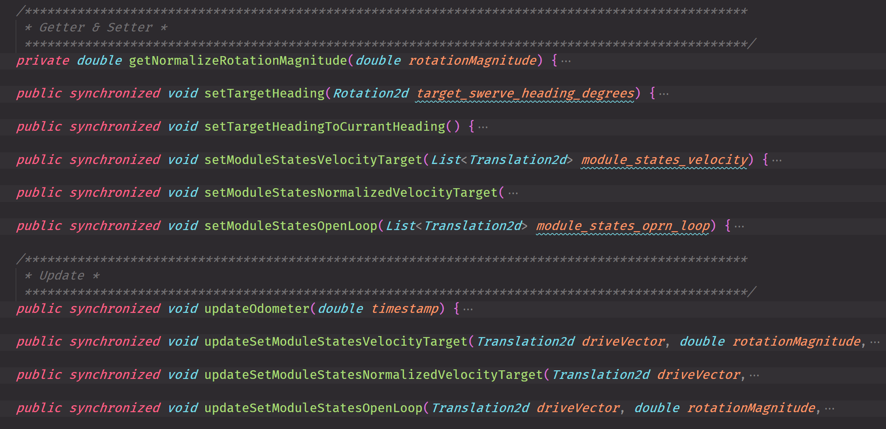
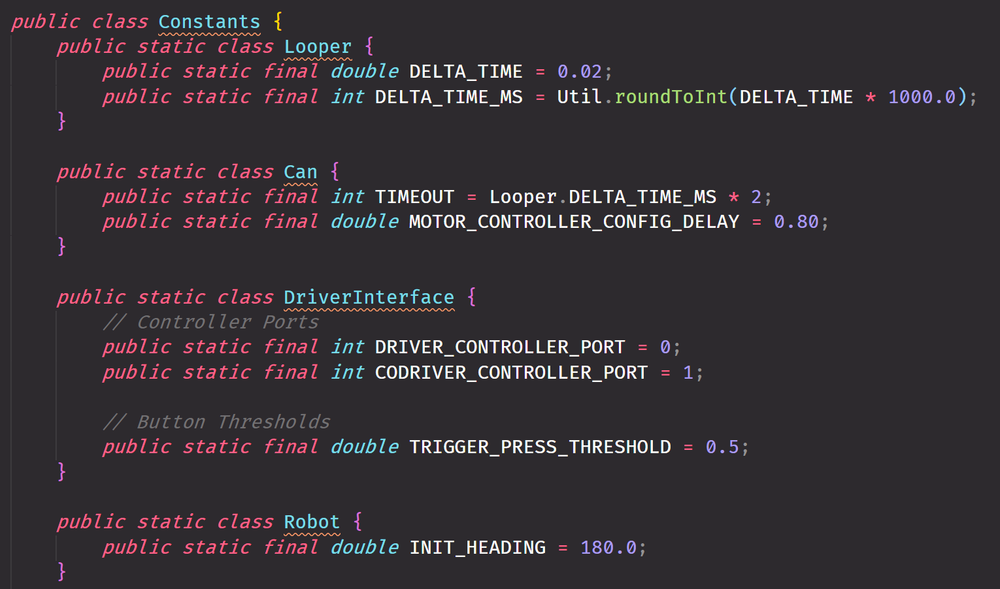
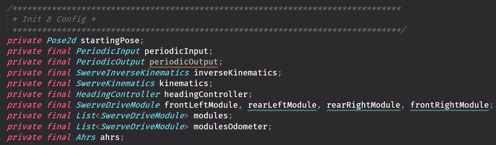
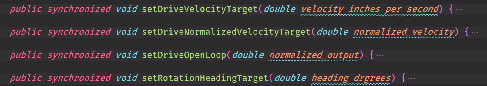

English | [中文简体](https://github.com/FRCNextInnovation/NI-Programming-Guide/blob/main/README.zh-CN.md)

# NI Programming Guide

  

This **programming guidebook** is used for development in **Next-Innovation(NI)**.

The guidebook is designed by the rules below:

- Do not ignore readability in order to blindly pursue the speed of code.
- On the premise of speed , readability is everything.
- On the premise of readability,  shorter is better.

Every developer should follow the rules while programming or pushing the code. 

This guidebook contains: 

1. Suggested VS-Code extensions.
2. The code style.

## Table of Contents
- [NI Programming Guide](#ni-programming-guide)
  * [1. VS-Code-Extensions](#1-vs-code-extensions)
  * [2. Code-Style](#2-code-style)
    + [2.1 Source-File](#21-source-file)
      - [2.1.1 License or copyright information](#211-license-or-copyright-information)
      - [2.1.2 Package statement](#212-package-statement)
      - [2.1.3 Import statements](#213-import-statements)
      - [2.1.4 Class](#214-class)
    + [2.2 Formatting](#22-formatting)
    + [2.3 Naming](#23-naming)
      - [2.3.1 Rules common to all identifiers](#231-rules-common-to-all-identifiers)
      - [2.3.2 Rules by identifier type](#232-rules-by-identifier-type)
        * [2.3.2.1 Package names](#2321-package-names)
        * [2.3.2.2 Class & Interface names](#2322-class---interface-names)
        * [2.3.2.3 Method names](#2323-method-names)
        * [2.3.2.4 Constant names](#2324-constant-names)
        * [2.3.2.5 Non-constant field names](#2325-non-constant-field-names)
        * [2.3.2.6 Local variable names](#2326-local-variable-names)
    + [2.4 Programming-Practices](#24-programming-practices)
  * [Maintainers](#Maintainers)
  * [Contributors](#Contributors)

## 1. VS-Code-Extensions

- [WPILIB](https://marketplace.visualstudio.com/items?itemName=wpilibsuite.vscode-wpilib)
- [Java Extension Pack](https://marketplace.visualstudio.com/items?itemName=vscjava.vscode-java-pack)
- [Bracket Pair Colorizer 2](https://marketplace.visualstudio.com/items?itemName=CoenraadS.bracket-pair-colorizer-2)
- [google-java-format](https://marketplace.visualstudio.com/items?itemName=ilkka.google-java-format)
- [Todo Tree](https://marketplace.visualstudio.com/items?itemName=Gruntfuggly.todo-tree)
- [GitLens — Git supercharged](https://marketplace.visualstudio.com/items?itemName=eamodio.gitlens)
- [Better-Comments](https://marketplace.visualstudio.com/items?itemName=aaron-bond.better-comments&ssr=false)

## 2. Code-Style
> Note: To have a better support for 3rd lib, only file names is necessary to be formatted.

### 2.1 Source-File

- Structure: 

  1. License or copyright information(if present).
  2. [Package](#212-package-statement) statement.
  3. [Import](#213-import-statements) statements.
  4. [Class](#214-class) statements.

#### 2.1.1 License or copyright information

- Example:

#### 2.1.2 Package statement

- No line-wrapped.
- The package statement should be divided from import statements by a blank line.

#### 2.1.3 Import statements

- Static import or otherwise are not used.

- No line-wrapped.

- Imports from the same package should be put together.

- Imports from different packages should be separated by a blank line.

- Example:

  Bad:

  

  Good:

  

#### 2.1.4 Class

- The order of members does not need to follow specific strict rules. What is important is that each class uses some logical order. 

- Overloads should never be split.

- Members of the same type should be put in the same block, and different blocks should be separated by annotation of a specific style.

- Example:

  Bad:

  

  Good: 

  

### 2.2 Formatting

- NI's format style is following the Google's format style of Java. You can click here for more information: [Google Java Style Guide - Formatting](https://google.github.io/styleguide/javaguide.html#s4-formatting).
- In fact, all formatting can be done by the extension -- [google-java-format](https://marketplace.visualstudio.com/items?itemName=ilkka.google-java-format).

### 2.3 Naming

#### 2.3.1 Rules common to all identifiers

Identifiers use ASCII letters and digits only.  On the premise of name readability,  shorter is better.

#### 2.3.2 Rules by identifier type

##### 2.3.2.1 Package names

- `lowercase`

- Example:

  

##### 2.3.2.2 Class & Interface names 

- `UpperCamelCase`

- The name of a concrete class cannot have a prefix or suffix.

- The name of an abstract class should have a prefix of "base".

- The name of the interface should have a prefix of "I".

- Example:

  

##### 2.3.2.3 Method names

- `lowerCamelCase`

- The name of the same type of method should start with the same word. For example, the subsystem of the chassis may have multiple setters to control the motors in different modes (Open-Loop, Velocity, Position), so their names should start with "set".

- Example:

  

  ##### 2.3.2.4 Constant names

- `UPPER_AND_UNDER_SCORE_CASE`

- Example:

  

##### 2.3.2.5 Non-constant field names

- `lowerCamelCase`

- Whether the variable is public or private, do not add any prefix or suffix to it.

- Example:

  

##### 2.3.2.6 Local variable names

- `lower_and_under_score_case`

- Example:

  

### 2.4 Programming-Practices

- Don't add unnecessary getter or setter.
- Always use `@Override`.
- Always use `synchronized` for all methods about IO.
- Do not ignore catching exceptions.
- Always specify the order of instantiation.

## Maintainers

[@Rocky_](https://github.com/RockyXRQ) [@ljy1992](https://github.com/ljy1992)

## Contributors

:heart: This project exists thanks to all the people who contribute. :heart:

[@ljy1992](https://github.com/ljy1992) [@Rocky_](https://github.com/RockyXRQ) [@yukikisss](https://github.com/yukikisss)

